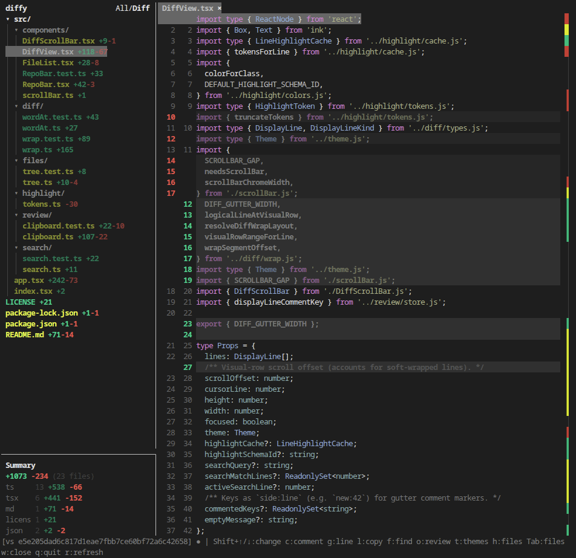

# Diffy

Terminal git diff reviewer (Ink + React). Browse a repo file tree, open full-file unified diffs with surrounding context, syntax highlighting, and line comments that compile into a markdown review.

Requires Node 20+, an interactive TTY, and `git`.



Licensed under [MIT](./LICENSE).

## Install

```bash
npm install
npm run build
npm link   # optional: install `diffy` globally
```

For local development without linking: `npm run dev` or `make dev`.

## Usage

```bash
diffy                              # all uncommitted changes
diffy --staged                     # staged only
diffy --base main                  # branch diff vs main
diffy --base origin/main --include-uncommitted
diffy --no-watch                     # disable auto-refresh
diffy --resume                       # resume latest review for this repo
diffy --resume review-main-2026-07-18-1024
```

`--staged` and `--base` cannot be combined.

### Layout

- **Files pane** — repo name, change summary (`+/-` totals by file type), and a tree. By default the tree includes unchanged files; press `d` for diffs-only.
- **Diff pane** — tab bar + full-file unified view (not hunk-only): unchanged lines filled in around changes, with add/delete coloring and syntax highlighting. Long lines soft-wrap within the pane.
- **Status bar** — mode label, watch indicator (`●` idle / `⟳` refreshing), and contextual key hints.

Drag the vertical split to resize panes. Collapse the files pane with `h`.

### Watching

Watching is on by default: diffy refreshes when files change or when you stage/unstage. Heavy directories (`node_modules`, `dist`, `.git`, …) are skipped. Use `--no-watch` to disable.

### Tabs

Arrow navigation in the file list opens a dim **preview** tab (leftmost) until the file is pinned with Enter or a double-click. Pinned tabs stay open; `w` closes the active tab. `←` / `→` switch tabs when the diff pane is focused (`←` on the first tab returns to the file list).

### Find & go to line

- `f` — find in the current file; Tab toggles **all files**; `↑` / `↓` cycle matches; Esc closes.
  Double-click a word in the diff to open Find with that word (or replace the query if Find is already open).
- `g` — jump to a source line number in the open file.
- `j` / `k` or `Shift+↓` / `Shift+↑` — jump to the next/previous change block (across files).

### Line comments & reviews

Press `c` on a diff line to add or edit a comment (empty + Enter deletes). Commented lines show a gutter marker. Press `o` for a review overview (Enter jumps to a comment). Quit with `q` (or Ctrl+C) to print the compiled markdown review (cyan), copy the plain text to the clipboard, and show a resume command.

Clipboard copy uses OSC 52 when the terminal supports it, then `pbcopy` (macOS), `wl-copy` / `xclip` / `xsel` (Linux), or a GTK fallback when those tools are missing. On Linux it also fills the PRIMARY selection so middle-click paste works in native terminals.

Reviews are cached under `~/.config/diffy/review-<branch>-<YYYY-MM-DD-HHMM>.json` only after you add at least one comment. Use `--resume` (latest) or `--resume <name>` to continue a previous review. Quitting with no comments writes nothing and prints no resume hint.

### Themes

Press `t` for themes (saved to `~/.config/diffy/config.json`):

- **Diff background** — add/delete row wash (several palettes; light/dark terminal aware).
- **Syntax highlight** — token color schemes (Default, Monokai, GitHub, Muted, Dracula, …).

In the menu: `↑` / `↓` select, Enter opens, `b` / `h` jump to background / syntax, Esc cancels. In a picker, `↑` / `↓` live-preview and Enter applies.

### Mouse

| Action | Effect |
|--------|--------|
| Click file | Open / focus as preview |
| Double-click file or preview tab | Pin tab |
| Click directory | Fold / unfold |
| Click **All/Diff** (files pane header) | Toggle diffs-only ↔ full repo tree (same as `d`) |
| Click diff line | Move cursor |
| Double-click word in diff | Find that word (replaces query if Find is open) |
| Click tab / tab × | Activate / close |
| Wheel | Scroll files or diff |
| Drag scrollbar | Scroll diff |
| Drag split border | Resize panes |

### Agent helpers

- `l` — copy `@path:line` for the current diff line (agent paste).
- `e` — edit the current file in `$VISUAL` / `$EDITOR` (default `nano`) at the cursor line.

## Keys

| Key | Action |
|-----|--------|
| `Tab` | Switch focus between file list and diff |
| `↑` / `↓` | Navigate files (preview tab) or scroll diff |
| `←` / `→` | Fold dirs (files) or switch tabs (diff; `←` on first tab returns to files) |
| `Enter` | Pin tab (file); toggle fold (dir) |
| `Space` / `→` | Open / focus diff (file); toggle fold (dir) |
| Double-click | Pin tab (file list or preview tab) |
| `w` | Close active tab |
| `g` | Go to line (enter source line number) |
| `l` | Copy `@path:line` for the current diff line |
| `e` | Edit current file in `$VISUAL` / `$EDITOR` at the cursor line |
| `f` | Find in file (Tab toggles all files; `↑`/`↓` cycle matches) |
| `PgUp` / `PgDn` | Page up/down in diff |
| `Shift+↓` / `Shift+↑` | Jump to next/previous change block (across files) |
| `j` / `k` | Same as Shift+↓ / Shift+↑ |
| `c` | Comment / edit comment on current line (diff focus) |
| `o` | Review overview (list comments; Enter jumps) |
| `t` | Themes (diff background + syntax highlight) |
| `h` | Collapse / expand the files pane |
| `d` | Toggle diffs-only file list (changed files only ↔ full repo tree) |
| `r` | Refresh |
| `Esc` | Cancel overlay (comment, find, go-to-line, themes, overview) |
| `q` / `Ctrl+C` | Quit (prints + copies review when there are comments; shows resume command) |
